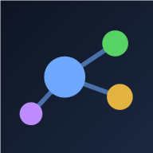

# ◈ Mind — your mind, mapped

A fast, beautiful, **offline** mind-map app in a single HTML file. No install, no accounts, no servers, no tracking. **All your data stays on your device.**

## ✨ Features
- **Drag-free thinking** — `Tab` adds a sub-point, `Enter` adds a node at the same level; **✨ Tidy** auto-arranges the whole tree.
- **Node types** — 💡 idea · ✅ task (checkable) · 📝 note · 🌙 journal, plus per-node emoji icons, colors, and notes.
- **⚡ Quick capture** (press `/`) drops a thought into an Inbox without losing your place.
- **📋 Today** gathers every task across all your maps into one checklist.
- **🎨 Themes** — 6 backgrounds (incl. light mode), accent colors, branch styles.
- **Multiple maps**, search, undo/redo, pinch-zoom, and **PNG / Markdown / JSON export**.
- **Installable** — add it to your home screen (phone) or install it (desktop) for a full-screen, offline app.

## 🔒 Privacy
There is **no login and no server**. Maps are saved in your browser (and optionally to files on disk via the 📁 button). Nothing ever leaves your device. To back up or move your maps, use **⤓ JSON** export / the 🗂 Maps import, or link a folder with 📁.

## 🚀 Use it
- **Just open `index.html`** in any modern browser (Chrome / Edge / Safari).
- Or host the folder anywhere static — e.g. **GitHub Pages**:
  1. Push this folder to a repo.
  2. Repo → **Settings → Pages** → deploy from the `main` branch.
  3. Open the Pages URL → on mobile, **Share → Add to Home Screen** for an app icon.

All paths are relative, so it works from the root *or* a subfolder.

## 💻 Install as an app (PC)
Open the site in **Chrome** or **Edge**, then:
1. Look at the right end of the address bar for the **install icon** (a small monitor with a ⊕, or a ⬇️ in a box). *Or* open the **⋮** menu → **Cast, save, and share → Install this page as an app** (Chrome) / **Apps → Install this site as an app** (Edge).
2. Click **Install**.
3. Mind opens in its own window and gets a **Start-menu / desktop / taskbar** shortcut — launch it like any normal program.

It runs full-screen, **works offline**, and updates automatically when the hosted version changes. To remove it: open the app → **⋮ menu → Uninstall** (or right-click the taskbar/Start icon → Uninstall).

> No install icon? Make sure you opened the **hosted URL** (e.g. your GitHub Pages link) over `https://`, not a local `file://` — browsers only offer install on a served page.

## 📱 Install as an app (iPhone / iPad / Android)
- **iPhone / iPad:** open in **Safari** → **Share** → **Add to Home Screen**.
- **Android:** open in **Chrome** → **⋮ menu** → **Add to Home screen / Install app**.

## ⌨️ Controls
| Action | How |
|---|---|
| Add sub-point / same-level | `Tab` / `Enter` (or the ＋ buttons on a node) |
| Edit text | double-click, `F2`, or the name field in the panel |
| Check off a task | tap the ✅ box |
| Undo / redo | `Ctrl+Z` / `Ctrl+Shift+Z` |
| Pan / zoom | drag empty space / scroll · pinch on touch |
| Fit to screen | ⤢ Fit |

## License
MIT — see [LICENSE](LICENSE). Built with Claude.
