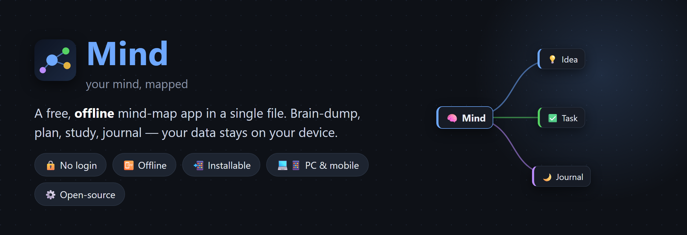

# ◈ Mind — your mind, mapped

A fast, beautiful, **offline** mind-map app in a single HTML file. No install, no accounts, no servers, no tracking. **All your data stays on your device.**

### 👉 Try it: **https://greatestselfhelp.github.io/Mind/**

## ✨ Features
- **Drag-free thinking** — `Tab` adds a sub-point, `Enter` adds a node at the same level; **✨ Tidy** auto-arranges the whole tree.
- **Node types** — 💡 idea · ✅ task (checkable) · 📝 note · 🌙 journal, plus per-node emoji icons, colors, and notes.
- **⚡ Quick capture** (press `/`) drops a thought into an Inbox without losing your place.
- **📋 Today** gathers every task across all your maps into one checklist.
- **🎨 Themes** — 6 backgrounds (incl. light mode), accent colors, branch styles.
- **Multiple maps**, search, undo/redo, pinch-zoom, and **PNG / Markdown / JSON export**.
- **Group & duplicate branches** — `Shift+click` (or the **＋ Group** button) to multi-select nodes, then **copy** a node *with all its sub-points* and **paste** them under any node — or **delete the whole group** at once.
- **📁 Folder auto-save** — keep a live copy of everything in a folder on your disk (survives browser cache resets).
- **Installable** — add it to your home screen (phone) or install it (desktop) for a full-screen, offline app.

## 🔒 Privacy
**No login, no server, no tracking.** Your maps never leave your device — they're saved locally, and that's it.

## 💾 How saving works (please read)
There's **no Save button to remember** — Mind saves as you go. There are two layers:

### 1. In the browser — automatic, always on
The moment you type, your maps are saved into the **browser's own storage** (`localStorage`) on that device. Close the tab and reopen the link → everything's still there. Nothing to press.

**But know this:** that storage belongs to *one browser on one device*. It does **not** sync between your phone and PC, and it gets **erased if you clear your browsing data / site data, or if you use private/incognito mode.** Great for everyday use — not a safe long-term home on its own. That's what layer 2 is for.

### 2. Save to a folder on your computer — your real backup *(Chrome / Edge on desktop)*
This writes your data to an actual file on your disk, so it's safe even if the browser forgets everything.

**How to turn it on (once):**
1. Click **📁 Folder** in the top bar.
2. Pick a folder (e.g. make one called `Mind`) and allow access.
3. That's it. The app creates **`mind-backup.json`** in that folder containing **all** your maps + settings.

**After that it's automatic** — Mind re-saves to that file:
- a few seconds after any change,
- **every 5 minutes**, and
- when you **close or switch away** from the tab.

**Loading it back:** next time you open Mind, it **reconnects to that folder and loads your data automatically.** If the browser asks for permission again (or the button shows **📁 Reconnect**), just click it once and choose the same folder — your maps reappear. This is how your data **survives a cache wipe**: it's sitting safely in `mind-backup.json`, and reconnecting merges it right back.

### Move to another device / extra backups
- **One-off backup:** **⤓ JSON** downloads a file you can keep anywhere.
- **Move between devices / restore:** **🗂 Maps → import** to load a `.json` back in, or point the new device at a copy of your `mind-backup.json` folder.

> 📱 On **iPhone/iPad/Android**, browsers don't allow folder access, so only layer 1 (browser storage) is available there — use **⤓ JSON** export for backups, or use the synced cloud version if you have one.

## 🚀 Open it

### 👉 Live app: **https://greatestselfhelp.github.io/Mind/**

That link **is** the app — just open it in your browser and start using it. No download, no sign-up. Want it as a proper app with its own icon? Install it (free) using the steps below.

## 💻 Install on PC (Windows / Mac — Chrome or Edge)
1. Open **https://greatestselfhelp.github.io/Mind/** in **Chrome** or **Edge**.
2. Look at the **right end of the address bar** (where the URL is) for a small **install icon** — a monitor with a ⊕, or a ⬇️ inside a box. Click it.
   - Don't see it? Open the **⋮** menu (top-right) → **Cast, save, and share → Install page as app…** (Chrome), or **Apps → Install this site as an app** (Edge).
3. Click **Install** in the little popup.
4. Done — Mind now opens in its **own window** with a **desktop / Start-menu / taskbar** icon, like a normal program. It runs full-screen and **works offline**.

> *To uninstall later:* open Mind → **⋮ menu → Uninstall**, or right-click its taskbar/Start icon → **Uninstall**.

## 📱 Install on iPhone / iPad
1. Open **https://greatestselfhelp.github.io/Mind/** in **Safari** (it must be Safari — not Chrome).
2. Tap the **Share** button (the square with an ↑ arrow, at the bottom or top of Safari).
3. Scroll down and tap **Add to Home Screen**.
4. Tap **Add** (top-right). The **Mind** icon appears on your home screen — tap it to open full-screen.

## 🤖 Install on Android
1. Open **https://greatestselfhelp.github.io/Mind/** in **Chrome**.
2. Tap the **⋮** menu (top-right).
3. Tap **Add to Home screen** (or **Install app**) → **Install / Add**.
4. The **Mind** icon lands on your home screen.

## ⌨️ Controls
| Action | How |
|---|---|
| Add sub-point / same-level | `Tab` / `Enter` (or the ＋ buttons on a node) |
| Edit text | double-click, `F2`, or the name field in the panel |
| Check off a task | tap the ✅ box |
| Add to group | `Shift+click` a node (or **＋ Group** in the panel) |
| Copy node + sub-points | `Ctrl+C` (or **📋 Copy**) — copies the node, or the whole group |
| Paste as sub-points | select a node, `Ctrl+V` (or **📌 Paste**) |
| Delete node / group | `Delete` (or **🗑** in the panel) |
| Undo / redo | `Ctrl+Z` / `Ctrl+Shift+Z` |
| Pan / zoom | drag empty space / scroll · pinch on touch |
| Fit to screen | ⤢ Fit |
| Save to a folder | 📁 Folder (then it auto-saves) |

## 🛠️ Run your own copy (developers)
- **Locally:** download the files and open `index.html` in Chrome/Edge.
- **Host it free** on GitHub Pages: fork/push this folder → repo **Settings → Pages → Deploy from branch → `main` → / (root)**. Your copy will be live at `https://<your-username>.github.io/<repo>/`. All paths are relative, so it works from the root *or* a subfolder.

## License
MIT — see [LICENSE](LICENSE). Built with Claude.
